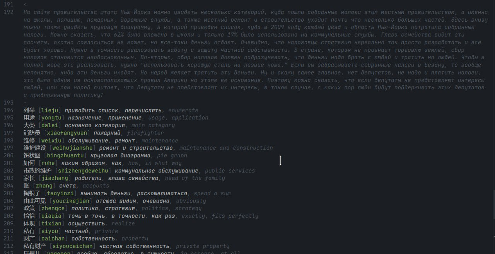

# Chinese Roofs

Расширение для VSCode, анализатор синтаксиса. Формат файла - `.chr`. Также требует ручного расширения темы дополнительными токенами. Для личного пользования.

## Показ

Одно слово:


Переведенный текст и словарь:



## Допольнительная конфигурация темы

```json
{
  {
    "scope": ["translation.text.chr"],
    "settings": {
      "fontStyle": "italic",
      "foreground": "#4D535C"
    }
  },
  {
    "scope": ["translation.vocabulary.word.original.chr"],
    "settings": {}
  },
  {
    "scope": ["translation.vocabulary.word.pinyin.chr"],
    "settings": {
      "foreground": "#4D535C"
    }
  },
  {
    "scope": "translation.vocabulary.word.pinyin.char.chr",
    "settings": {
      "foreground": "#84A360"
    }
  },
  {
    "scope": "translation.vocabulary.word.pinyin.tone.chr",
    "settings": {
      "foreground": "#4D535C"
    }
  },
  {
    "scope": "translation.vocabulary.word.translation.chr",
    "settings": {
      "fontStyle": "italic"
    }
  }
}
```
